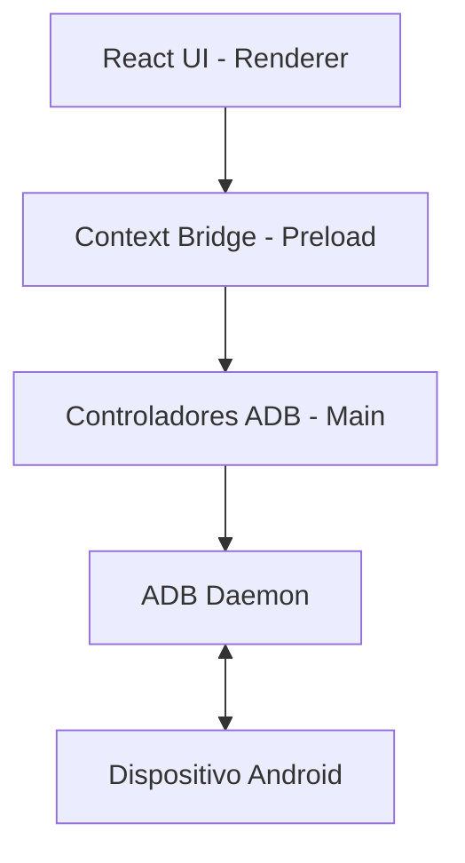

# Arquitectura del Sistema

El "Copiloto de Reparaciones Celulares" es una aplicación robusta construida con tecnologías web modernas, diseñada para ejecutarse como una aplicación nativa de escritorio.

## Stack Tecnológico
- **Core de Escritorio:** Electron (Manejo de ventanas, acceso nativo al SO).
- **Procesamiento Frontend:** React (UI interactiva) y Vite (Empaquetador ultrarrápido).
- **Lenguaje Principal:** TypeScript (Proporciona tipado estático, reduciendo bugs y mejorando la mantenibilidad).
- **Estilos:** SCSS (Módulos de estilos para encapsulación).
- **Gestión de Estado:** MobX (Estado global reactivo para la UI).

## Estructura de Procesos de Electron
1. **Main Process (`src/main/`):**
   - Es el "backend" local.
   - Tiene acceso total a los módulos de Node.js (fs, child_process, path).
   - Administra la ejecución de comandos ADB a través del shell (`src/main/lib/adb.ts`, `src/main/lib/forensic.ts`, etc.).
   - Emite eventos al Renderer cuando hay cambios de estado de dispositivos.

2. **Renderer Process (`src/renderer/main/`):**
   - Es el "frontend" visualizado por el usuario.
   - Renderiza los componentes de React (`App.tsx`, `Layout.tsx`, modales).
   - Se comunica con el Main Process a través de un puente seguro (IPC).

3. **Preload Script (`src/preload/`):**
   - Expone un puente seguro (`contextBridge`) entre Node.js y el entorno web, permitiendo a la interfaz de usuario solicitar la ejecución de comandos ADB de forma segura.

## Diagrama Lógico Simplificado

