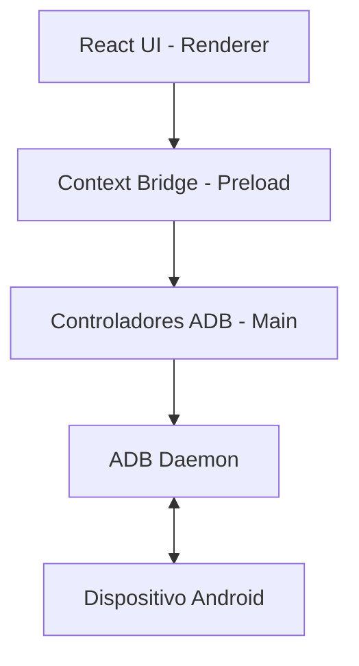

# Arquitectura del Sistema y Entorno de Desarrollo

El "Copiloto de Reparaciones Celulares" es una aplicación robusta construida con tecnologías web modernas, diseñada para ejecutarse como una aplicación nativa de escritorio.

## Entorno de Desarrollo Local
Para contribuir o depurar el proyecto, necesitas configurar tu entorno local. No recomendamos modificar archivos directamente en producción.

### Prerrequisitos
- **Node.js** (v18.x o superior)
- **Git**
- **Android SDK Platform-Tools** (ADB debe estar disponible en el PATH, aunque el proyecto intentará descargar uno de respaldo si es necesario).

### Instalación y Ejecución
1. **Clonar e Instalar:**
   ```bash
   git clone https://github.com/CarryCash/Kumodo.git
   cd Kumodo
   npm install
   ```
2. **Descargar Binarios Base:**
   La aplicación depende de binarios como `adb` y `scrcpy`. Debes descargarlos en tu entorno local antes de compilar:
   ```bash
   npm run adb
   npm run scrcpy
   ```
3. **Levantar el entorno en Desarrollo (Hot-Reload):**
   ```bash
   npm run dev
   ```
   Esto iniciará Vite para el Renderer y compilará el proceso Main en paralelo, abriendo la ventana de Electron.

## Estructura de Procesos de Electron
1. **Main Process (`src/main/`):**
   - Es el "backend" local.
   - Tiene acceso total a los módulos de Node.js (fs, child_process, path).
   - Administra la ejecución de comandos ADB a través del shell (`src/main/lib/adb.ts`, `src/main/lib/forensic.ts`, etc.).
   - Emite eventos al Renderer cuando hay cambios de estado de dispositivos.

2. **Renderer Process (`src/renderer/main/`):**
   - Es el "frontend" visualizado por el usuario.
   - Renderiza los componentes de React (`App.tsx`, `Layout.tsx`, modales).
   - Se comunica con el Main Process a través de un puente seguro (IPC).

3. **Preload Script (`src/preload/`):**
   - Expone un puente seguro (`contextBridge`) entre Node.js y el entorno web, permitiendo a la interfaz de usuario solicitar la ejecución de comandos ADB de forma segura.

## Diagrama Lógico Simplificado


